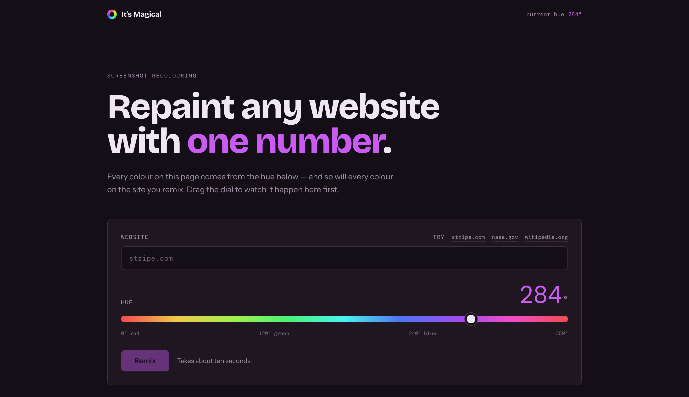
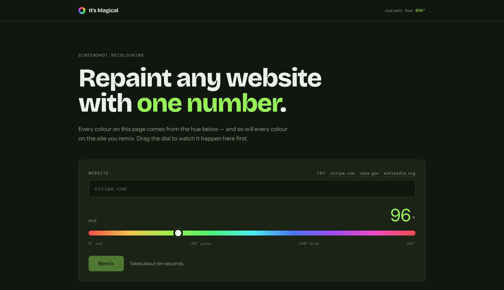

# It's Magical

Repaint any website with one number.

Give it a URL and a hue, and it loads the real page in a headless browser,
overrides every colour the site declares, and hands back a screenshot of the
result.

<table>
  <tr>
    <td width="50%"></td>
    <td width="50%"></td>
  </tr>
</table>

Those are the same page at two hues. The interface themes itself from the value
on the dial using the same colour relationships it will apply to your target
site, so the control previews the transformation before you ever run it.

## The idea

Recolouring an arbitrary website is hard if you try to parse its stylesheet:
every site structures colour differently, and there is no reliable "primary
colour" to swap.

So this doesn't parse anything. It takes one number — the hue, 0–359 — and
rebuilds an entire palette from it in HSL, then forces that palette onto every
colour property on the page:

```css
:root {
  --hue: 284;
  --color-richer:    hsl(var(--hue), 50%, 72%);
  --color-highlight: hsl(var(--hue), 70%, 45%);
  --link-color:      hsl(var(--hue), 90%, 70%);
  --background:      hsl(var(--hue), 20%, 12%);
}

* {
  color: var(--color-richer) !important;
  background-color: var(--background) !important;
  border-color: var(--color-light) !important;
  /* ...every other colour property */
}
```

Saturation and lightness are fixed by the palette; only the hue comes from the
user. That is the whole trick, and it is why the tool works on any URL without
knowing anything about the site: a blunt instrument applied uniformly produces
a coherent result where a clever one would produce a broken one.

## How it works

| Step | What happens |
| --- | --- |
| **Capture** | The URL is normalised and validated, then opened in a hosted headless Chrome session via [Browserless](https://browserless.io). |
| **Repaint** | The generated stylesheet is injected with `addStyleTag` after load and before capture, so the screenshot is of the recoloured page. |
| **Return** | The PNG is written to S3 and returned as a presigned URL that expires in 15 minutes. |

The entire API surface is one route: [`pages/api/remix.js`](pages/api/remix.js).

## Running it locally

```bash
npm install
cp .env.example .env.local   # then fill in your own credentials
npm run dev
```

You need a [Browserless](https://browserless.io) token and an S3 bucket. The
IAM user needs only `s3:PutObject` and `s3:GetObject` on that one bucket — the
app does nothing else with AWS, so don't hand it a broadly scoped key.

Without credentials the interface still runs; the API returns a message naming
the variables it is missing.

## Notes

- URLs pointing at `localhost`, link-local, or private ranges are rejected, so
  the screenshot browser can't be pointed at internal infrastructure.
- Results are served as presigned URLs rather than public objects, which keeps
  the bucket private and makes shared links expire on their own.
- Fonts are self-hosted at build time through `next/font`, so the page makes no
  third-party requests at runtime.
- Sites that block automated browsers, or that render entirely in canvas or
  images, won't recolour meaningfully — there are no CSS colours to override.

## Built with

Next.js (pages router) · React · Browserless · AWS S3 · deployed on Vercel

---

A passion project by [Darren Alderman](https://github.com/amblemind). © AmbleMind LLC
